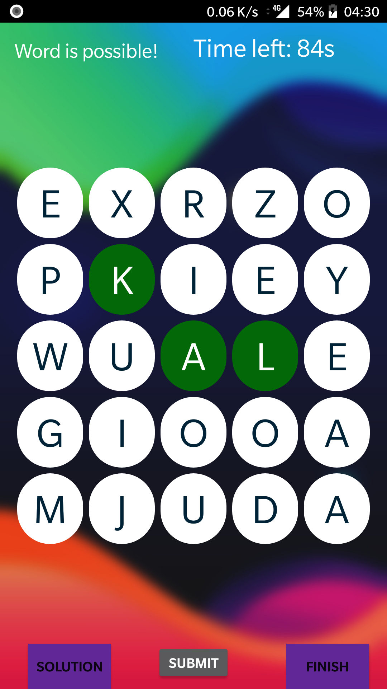

# Word-Search
A word-search game made for Android devices. The app features a complete gameplay with an attractive UI. The mobile application was developed for submission against Google's ACSWA (Applied Computer Science with Android).

The main focus of this application was to understand the use of data structures and their applications in real life. For this project, Tries, Hashmaps and LinkedLists were used to dynamically predict if any word is possible for the given chosen sequence of letters.

The game is played by forming as many words as possible from the grid of letters. Letter sequences can be in any direction as long as they are adjacent to the previous letter. Scores are provided based on the length of the word and the goal of the game is to score as many points as you can before the timer runs out.

The following is a screenshot of the app:
 

